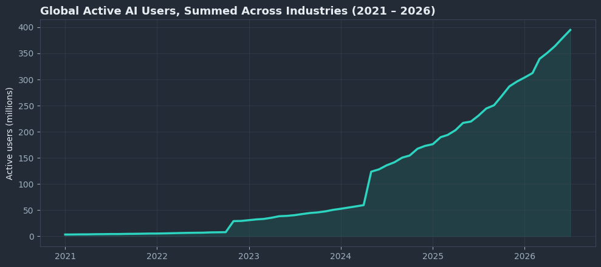
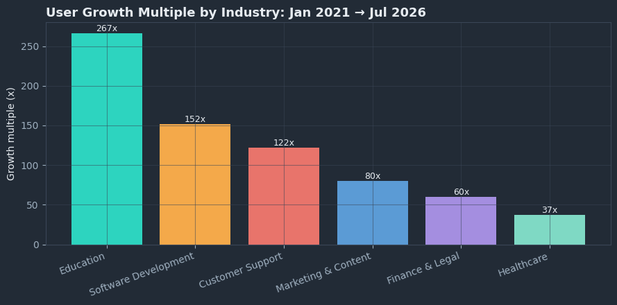
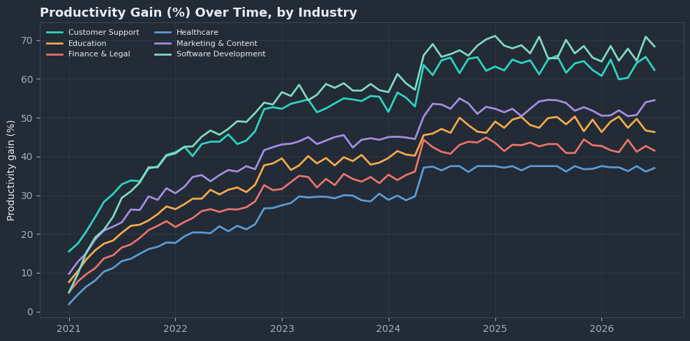
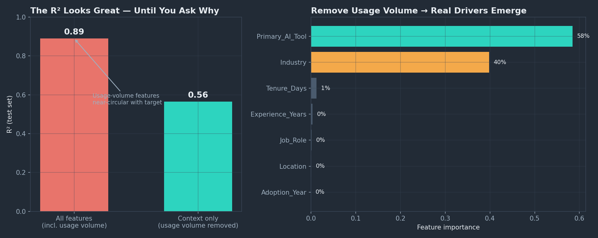
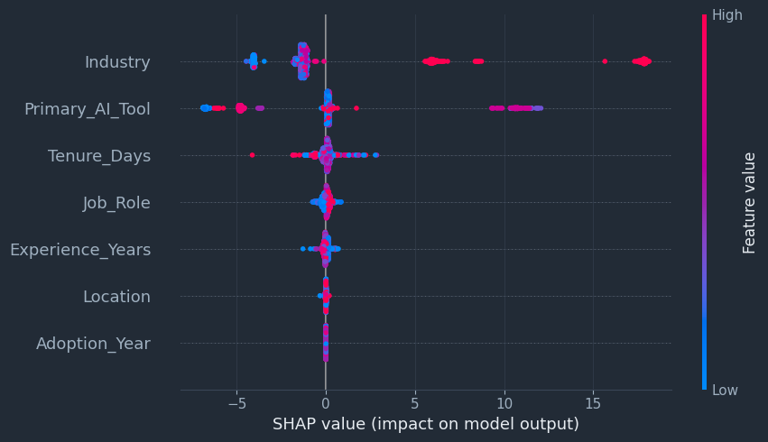

# Global AI Usage & Productivity (2021–2026)

Does AI adoption actually move the productivity needle — or does the headline number just restate how much someone used the tool?

This project analyzes two linked datasets: a 402-row industry × month macro panel tracking global AI adoption from January 2021 to July 2026, and a 15,000-row user-level dataset capturing individual tool choice, role, region, tenure, and self-reported productivity gain.

## Key findings

- **Global active users grew ~120x** from 3.3M (Jan 2021) to 395M (Jul 2026), with no plateau visible in this window.
- **Education adopted fastest (267x growth)**, but **Software Development converts adoption into the largest productivity gain** (68.4% as of the latest month). Fast adoption and high payoff are not the same thing.
- The two datasets use **incompatible industry taxonomies** — flagged rather than papered over with a silent merge.
- **Experience correlates at ~0 with productivity gain** (-0.01); daily usage volume correlates at 0.88. Tenure alone buys nothing in this data.
- A full-feature model hits R² = 0.89, but **99%+ of that comes from two usage-volume columns that are near-circular with the target** — not a genuine business insight. Removing them (R² drops to a more honest 0.56) surfaces the real, interpretable drivers: **tool choice (58% importance) and industry (40%)**.
- **Coding-adjacent tools and roles show roughly double the productivity gain of everyone else** — GitHub Copilot/DeepSeek users and Software Engineers/Data Scientists/QA Testers/DevOps Engineers report 22–42% mean gains vs. 9–10% for general-assistant users and non-technical roles.

## Adoption grew ~120x in five and a half years

Education grew fastest in relative terms, but growth speed and productivity payoff turned out to be two different things:

## The gap between industries widens over time, it doesn't converge

## The modeling "gotcha": a great R² can hide a circular feature

This is the finding that shaped the whole modeling section. A model trained on every available feature reaches R² = 0.89 — but almost all of that comes from two usage-volume columns that are near-mechanically tied to the target. Removing them drops R² to a more honest 0.56, and that's exactly when tool choice and industry emerge as the real, interpretable drivers.

SHAP confirms the same pattern at the individual-prediction level — coding-oriented tools and the Software Development industry consistently push predicted productivity gain up, while Midjourney and Creative & Design push it down:

## Structure (PACE framework)

1. **Plan** — business questions and dataset overview
2. **Analyze** — data quality checks, including the industry-taxonomy mismatch between files
3. **Macro trends** — adoption growth and productivity gain by industry, 2021–2026
4. **User-level patterns** — tool, industry, role, and correlation analysis on 15K individuals
5. **Construct** — two-pass regression modeling (all features vs. context-only) to separate a near-circular usage signal from genuine business drivers, plus SHAP explainability
6. **Execute** — findings, recommendations, and stated limitations

## Tech stack

Python · pandas · Plotly (interactive) · Matplotlib (static fallback) · scikit-learn · XGBoost · SHAP

## Links

- Kaggle: [zohairbaloch](https://www.kaggle.com/zohairbaloch)
- GitHub: [zohairbaloch-64](https://github.com/zohairbaloch-64)
- LinkedIn: [zohair-baloch-data-analyst](https://www.linkedin.com/in/zohair-baloch-data-analyst)

## Data source

[Global AI Usage and Productivity](https://www.kaggle.com/datasets/ashyou09/global-ai-usage-and-productivity) — Kaggle
